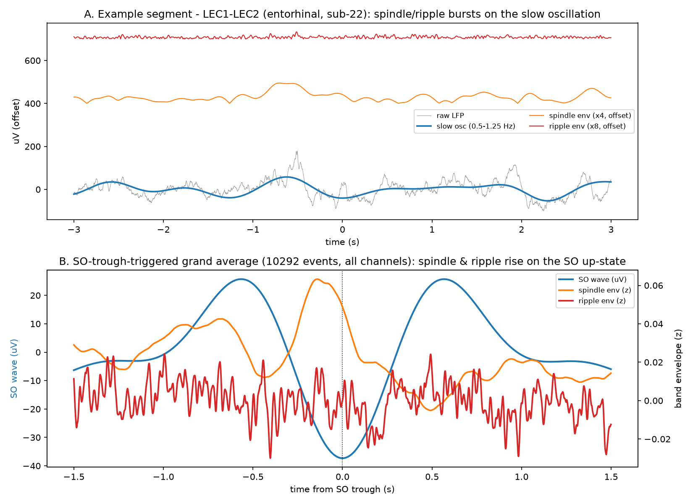
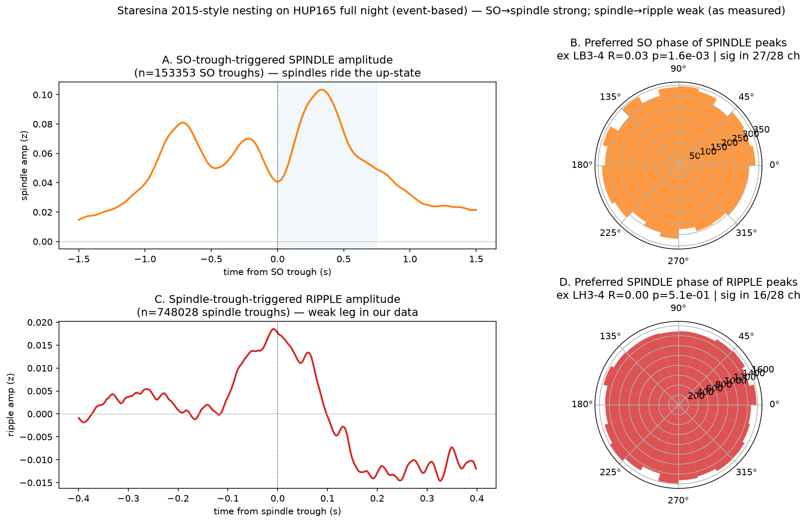

# iEEG — Human test of NREM hierarchical nesting (slow oscillation → spindle → ripple)

Does the NREM slow oscillation organize faster activity — spindles and ripples — in **human medial
temporal lobe**? This is the **hierarchical nesting** described by
[Staresina et al. 2015, *Nat Neurosci*](https://doi.org/10.1038/nn.4119) in the human hippocampus,
and the question here is whether it replicates across **independent, open** iEEG cohorts, with **no
new patient access or committee approval required**.

Related work this nesting is often connected to — and which this repository does **not** test:
sleep-dependent CSF clearance and its noradrenergic control
([Hauglund et al. 2025, *Cell*](https://doi.org/10.1016/j.cell.2024.11.027)). **No clearance is
measured here**; the nesting is a candidate neural substrate, and that link remains a hypothesis
belonging to those authors, not a result of this work.

Sister project to the Buzsáki mouse pilot (`hpaticmousebuzsakilab`): the mouse showed 50 Hz
vibrotactile drive organized dorsal-hippocampal firing at **theta**, but not in the
**0.5–4 Hz slow-wave** band — because it had no natural NREM. This project supplies that state.

**Start here:** [docs/iEEG_EVIDENCE_BRIEF.md](docs/iEEG_EVIDENCE_BRIEF.md) (2-page spine) ·
[docs/FIGURE_GUIDE.md](docs/FIGURE_GUIDE.md) (plain-English map of every figure) ·
[docs/PLAN.md](docs/PLAN.md).

---

## The main finding — the coordination itself

**Spindles and ripples ride the slow-oscillation up-state.** Left: a raw entorhinal segment with the
slow oscillation and the spindle/ripple envelopes. Right: the SO-trough-triggered grand average over
10,292 events — spindle power (orange) peaks just before the up-state, with ripple power (red)
nested inside it.



**Event-based replication across a full continuous night** (HUP165, iEEG.org — 153,353 SO troughs,
748,028 spindle troughs). **Both legs of the Staresina hierarchy are present in this single
subject:** spindle peaks lock to SO phase in **27/28 channels**, and ripple peaks lock to spindle
phase in **16/28 channels** — so SO ⊃ spindle ⊃ ripple is reproduced, though modestly
(R ≈ 0.03–0.05 vs the canonical R ≈ 0.2–0.4).

⚠️ **Method matters here.** The *continuous* phase-amplitude approach across cohorts
(Falach n=15, Zurich n=9) finds the spindle→ripple leg null-to-tiny and concludes the full
hierarchy is **not** supported — see [docs/HIERARCHICAL_COUPLING.md](docs/HIERARCHICAL_COUPLING.md).
The *event-based* test above is more sensitive to that leg and does detect it. The two are
reconciled in that document; the honest summary is **SO→spindle robust across three cohorts,
spindle→ripple detectable event-based but weak and method-dependent.**



*Every figure explained in plain English: [docs/FIGURE_GUIDE.md](docs/FIGURE_GUIDE.md).*

---

## Related study on another branch — LC infraslow coupling (**negative**)

Branch [`lc-infraslow-3ABD`](../../tree/lc-infraslow-3ABD) holds a separate, self-contained study
asking whether the **locus coeruleus** leaves a shared ~0.02 Hz (~50 s) rhythm in sleep spindles and
heart rate ([Lecci 2017](https://doi.org/10.1126/sciadv.1602026)). Across 23 subjects from the
iEEG.org HUP cohort — the 25 subjects that carry **simultaneous depth electrodes and EKG** — the
answer is **no**, with no N2/N3 difference in any test. It is not merged into `master`.

**Note on an apparent conflict.** That branch reports its SO→spindle test (3D) as null, while this
study reports SO→spindle coupling as robust. These are different measurements, not a contradiction:
here the question is whether coupling is **state-dependent** (MI_z, N3 vs wake/REM, *mesiotemporal*
contacts, curated IED-annotated clips); there it is how **large** the coupling is in absolute terms
(raw MI, *lateral neocortical* contacts, continuous streams, narrower individual spindle band, slow
oscillations detected on the channel average). A coupling can be reliably state-dependent and still
small in magnitude. The full comparison is in that branch's README.

## Datasets used (all open; raw data gitignored)

| # | Dataset | Rate | Coverage | Used by |
|---|---|---|---|---|
| 1 | **Normative iEEG Sleep & Wake Atlas** — Pattnaik & Litt 2024, Pennsieve DOI [10.26275/xhte-d11l](https://doi.org/10.26275/xhte-d11l) (HUP cohort; 30 s clips, W/N2/N3/R) | 204 Hz | mesiotemporal + neocortex | `slow_power_by_state`, `slow_spindle_coupling`, `mtl_region_profile` |
| 2 | **iEEG sleep + IED/HFO annotations** — Falach/Geva-Sagiv/Eliashiv 2024, [Figshare 26131978](https://figshare.com/articles/dataset/26131978) (~3 min NREM/subject) | 1 kHz | MTL SEEG (amygdala, hippocampus, entorhinal) | `slow_ripple_coupling`, `nesting_timecourse` |
| 3 | **Zurich HFO sleep atlas** — Fedele/Sarnthein, OpenNeuro [ds003498](https://openneuro.org/datasets/ds003498) (5-min SWS runs × 25–35/subject; expert HFO markings) | 2 kHz | MTL SEEG | `hfo_slow_phase` |
| 4 | **iEEG.org continuous** — e.g. `HUP165_phaseII` (~19 days continuous; one full NREM night pulled to `data/ieeg_portal/HUP165_night1/`) | 1024 Hz | MTL depth (LA/LB/LC/LH) | follow-on within-night analysis |

Fetchers: dataset 1 via `analysis/atlas.py` (Pennsieve API); datasets 2–3 via public download;
dataset 4 via `analysis/ieeg_portal.py` + `analysis/ieeg_pull_night.py` (see
[docs/IEEG_ORG_SETUP.md](docs/IEEG_ORG_SETUP.md)).

## Analysis modules (one script → one result → one figure)

| Script | What it shows | Dataset |
|---|---|---|
| `slow_power_by_state` | slow-band (0.5–4 Hz) power rises wake→N3 (p = 2.9×10⁻⁶) | 1 |
| `slow_spindle_coupling` | slow-oscillation → spindle coupling, NREM-specific (p = 0.030) | 1 |
| `mtl_region_profile` | slow-power & coupling by MTL region (descriptive; pairwise n.s.) | 1 |
| `slow_ripple_coupling` | slow-oscillation → ripple (p = 0.0015) **and** → spindle (p = 6×10⁻⁵, replicates coupling) | 2 |
| `nesting_timecourse` | time-domain SO-triggered averages: spindle/ripple ride the SO up-state | 2 |
| `hfo_slow_phase` | SO-phase of expert-marked ripples/fast-ripples (independent cohort) | 3 |
| `mouse_human_bridge` | the mouse-theta vs human-slow bridge figure | — |
| `make_result_visuals` | explanatory raw-signal / spectrum / slopegraph figures | 1 |

## Layout
```
analysis/       one script per module (above) + data fetchers (atlas, ieeg_portal, ieeg_pull_night)
outputs/        figures (png/svg) + summary csv, one folder per module; all_figures/ = consolidated
docs/           evidence brief, figure guide, per-module writeups, plan, iEEG.org setup
data/           downloaded raw data + credentials — GITIGNORED (reproduced by the fetchers)
env/            requirements.txt
```
