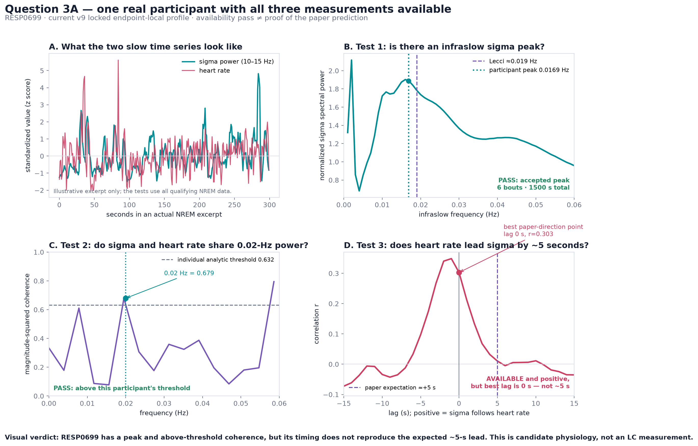
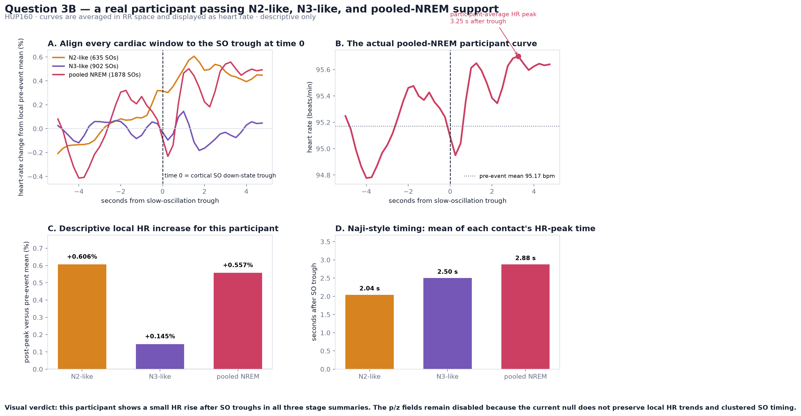
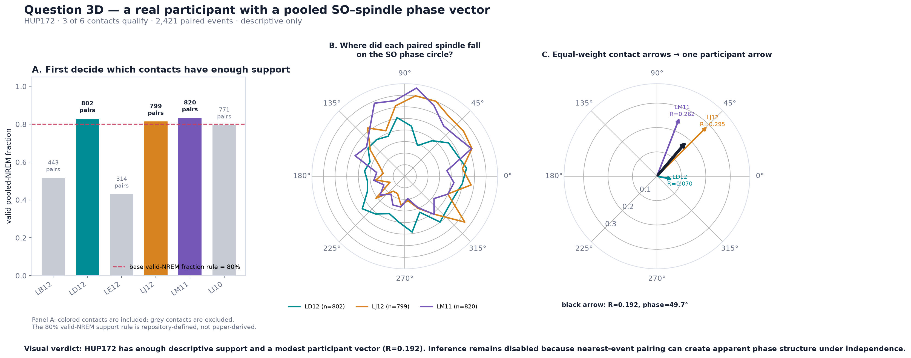

# LC-motivated sleep physiology in human iEEG

This repository asks whether human sleep iEEG and ECG contain three downstream physiological
patterns motivated by LC/norepinephrine research. It does **not** directly measure LC firing or
norepinephrine, so the endpoints are candidate physiological signatures rather than validated
human LC biomarkers.

Exact versioned results, endpoint-specific participant counts, audit evidence, and rebuild rules
live in the [results report](docs/QC_SENSITIVITY_RESULTS_2026-07.md),
[issue register](docs/ISSUE_REGISTER_2026-07.md),
[audit corrections](docs/AUDIT_CORRECTIONS_2026-07.md), and
[artifact policy](docs/ARTIFACT_POLICY.md).

## What this study tests

The branch examines three kinds of NREM physiology:

| Test | Measurement | Defensible interpretation | Paper basis |
|---|---|---|---|
| 3A | Infraslow structure in 10–15 Hz sigma power, plus sigma–cardiac cross-correlation | An **LC-motivated candidate signature**; not an LC measurement | [Lecci et al. (2017)](https://pmc.ncbi.nlm.nih.gov/articles/PMC5298853/) |
| 3B | Timing of RR minima/heart-rate bursts after cortical slow-oscillation down-states | A CNS–autonomic timing measure; not an LC-specific proxy | [Naji et al. (2019)](https://escholarship.org/uc/item/5393b9zk) |
| 3D | Slow-oscillation phase at one maximal 12–16 Hz spindle per SO epoch | Generic SO–spindle nesting and a signal-quality/physiology check; not an LC proxy | [Staresina et al. (2015)](https://pmc.ncbi.nlm.nih.gov/articles/PMC4625581/); [Helfrich et al. (2018)](https://pmc.ncbi.nlm.nih.gov/articles/PMC5754239/) |

Direct LC/NE measurement or manipulation in the cited anchor literature is confined to mouse
experiments (Osorio-Forero and Jacobsen), not the human arms. Lecci's human analysis used scalp
EEG/ECG, 0.5–4 Hz SWA and 10–15 Hz sigma, artifact-free NREM bouts of at least 120 s within the
first 210 min after sleep onset, and reported approximately 0.02-Hz modulation; it did not record
LC or norepinephrine. Naji used scalp PSG derivations F3/A2 and F4/A1, uninterrupted 3-min bins,
0.5–100 Hz ECG, Pan–Tompkins R-wave detection with visual confirmation, and RR resampled to 4 Hz
with a piecewise cubic spline. The study related SO-triggered RR/HR timing to a behavioral endpoint;
it did not measure LC. Staresina and Helfrich supplied SO–spindle methods, not LC validation.
Consequently this repository cannot prove human LC specificity without an independent
LC/NE-sensitive measurement or intervention.

SWA means **slow-wave activity**: broadband EEG/iEEG power at approximately **0.5–4 Hz**. It tends
to rise in deeper NREM. SWA is not a discrete slow-oscillation event and is not an LC measurement.

## Participant examples: what the measurements look like

These are deidentified, participant-derived examples recomputed from the current validated
artifacts. They were selected after analysis to make each measurement visually understandable;
they are illustrations, not held-out evidence or proof of a cohort effect. Full-size editable
versions, exact values, and provenance are in the
[participant visual guide](outputs/participant_result_visuals/README.md).

### 3A — RESP0699: a peak and coherence, but not the expected timing



RESP0699 has all three 3A measurements available: an accepted sigma-power peak at **0.0169 Hz**
near Lecci's approximately 0.019-Hz rhythm, coherence of **0.679** above its nominal
participant-level threshold of **0.632**, and positive paper-direction cross-correlation. However,
the strongest correlation occurs at **0 s**, not the approximately **+5 s** timing expected from
Lecci. No analyzed participant combines a target-compatible peak, above-threshold coherence, and
the expected timing, so this is a useful partial example—not a participant who fully “meets 3A,”
and not evidence of LC activity.

### 3B — HUP160: a descriptive SO-linked heart-rate rise



HUP160 has enough support for the N2-like, N3-like, and pooled-NREM summaries. Its local heart-rate
changes are **+0.606%**, **+0.145%**, and **+0.557%**, with mean contact peak times of
**2.04–2.88 s** after the SO trough. This shows what a Naji-direction participant trace looks like,
but valid event-locking p/z inference is disabled and the iEEG-derived stage labels and sensors
differ from Naji's scalp-PSG analysis. It is not a Naji replication or an LC measurement.

### 3D — HUP172: descriptive SO–spindle phase concentration



HUP172 contributes **2,319** paired events across three qualified contacts. Its equal-contact
participant vector has concentration **R = 0.193** and preferred phase **48.5°**, illustrating the
phase clustering that 3D is designed to measure. The estimate is descriptive: production
inference is disabled because nearest-spindle selection within a finite SO-centered window can
create apparent phase structure even under independence. This is evidence that the event pipeline
can recover an interpretable pattern, not proof of significant coupling or LC activity.

## Audit and limitations

Detailed technical material is maintained outside this overview:

- [What the audit fixed](docs/AUDIT_FIXES_2026-07.md)
- [Important unresolved limitations](docs/UNRESOLVED_LIMITATIONS_2026-07.md)

## Rebuild and verify

Raw HUP data/caches are not committed and require iEEG.org access.

```bash
python -m venv .venv
.venv/bin/python -m pip install -r env/requirements.txt

.venv/bin/python analysis/cache_lc_series.py --force
.venv/bin/python analysis/stage_ds003848.py --force
.venv/bin/python analysis/calibrate_staging_windows.py \
  --update-profile-pin

for grid in coverage_oat_v1 staging_window_support_v1 \
            auxiliary_window_support_v1 event_count_oat_v1; do
  .venv/bin/python analysis/run_qc_grid.py \
    --cache-dir data/derived/lc_infraslow --grid "$grid"
  .venv/bin/python analysis/run_qc_grid.py \
    --cache-dir data/derived/ds003848 --grid "$grid"
done

# Replace the large local grids with reviewable public summaries and preserve
# the complete locked HUP profile needed by the paired comparison.
.venv/bin/python analysis/compact_qc_grid_artifacts.py
```

`run_qc_grid.py` validates exact cache manifests/bytes, the pinned calibration, runtime, source
tree, and profile hashes before writing strict JSON. It records endpoint-specific availability and
the default five-participant reporting gate without changing subject estimates. Full grids under
`outputs/qc_grid/` are ignored build products. The compact checked-in evidence under
`outputs/qc_grid_public/` retains every profile/count and participant endpoint-availability record;
its terminal manifest hashes the exact nine-file evidence set. See
[`docs/ARTIFACT_POLICY.md`](docs/ARTIFACT_POLICY.md).

Run the available checks:

```bash
.venv/bin/python -m pip check
.venv/bin/python -m compileall -q analysis
.venv/bin/python analysis/test_corrected_estimators.py
.venv/bin/python analysis/test_lecci_faithful.py
.venv/bin/python analysis/test_spectral_gapped.py
.venv/bin/python analysis/test_overlap_aggregate.py
.venv/bin/python analysis/test_qc_profiles.py
.venv/bin/python analysis/test_event_3d_cache_support.py
.venv/bin/python analysis/test_calibrate_staging_windows.py
.venv/bin/python analysis/test_3B_null.py
.venv/bin/python analysis/test_run_integrity.py
.venv/bin/python analysis/test_cache_producer_integrity.py
.venv/bin/python analysis/test_manifest_contract.py
.venv/bin/python analysis/test_compare_qc_rebuilds.py
.venv/bin/python analysis/test_public_artifacts.py
.venv/bin/python analysis/test_paired_artifact_contracts.py
.venv/bin/python analysis/test_paired_reporting.py
.venv/bin/python analysis/test_paired_release_provenance.py
.venv/bin/python analysis/test_scalp_f3_f4_exploratory.py
.venv/bin/python analysis/test_paired_scalp.py \
  --artifact-validation publication
.venv/bin/python analysis/scalp_f3_f4_artifact_validation.py \
  --artifact-validation publication
.venv/bin/python analysis/test_coherence_calibration.py --require-real-cache
```

Publication checks deliberately fail if their required current private cache lineage is absent or
stale. Clean-checkout CI uses `--artifact-validation offline`, which still requires and validates
all tracked evidence and skips only ignored `data/derived` manifests.

The simultaneous scalp sensitivity uses the exact pinned HUP interval, ECG/RR, and stage labels:

```bash
.venv/bin/python analysis/cache_paired_scalp.py \
  --force
.venv/bin/python analysis/audit_hup_scalp_inventory.py
.venv/bin/python analysis/paired_scalp_ieeg_comparison.py
.venv/bin/python analysis/scalp_f3_f4_exploratory.py
```

After rebuilding the compact public QC artifacts, regenerate the deterministic
v8-to-v9 machine comparison from its tracked historical snapshot:

```bash
.venv/bin/python analysis/compare_qc_rebuilds.py \
  --write-machine-summary
```

The scalp sidecars are ignored derived data. The checked-in inventory proves the complete
25-person pinned cohort intersection before the comparison accepts the measured,
activity-eligible C3/C03 subset; the subset size is derived from that inventory rather than
hard-coded.
The strict, hash-manifested comparison outputs and their interpretation are in
[`docs/PAIRED_SCALP_IEEG_RESULTS_2026-07.md`](docs/PAIRED_SCALP_IEEG_RESULTS_2026-07.md).
`outputs/paired_scalp_ieeg/paired_metrics.csv` is the normalized table for pooled descriptive
work. `role_pair_metrics.csv` retains explicit F3/Fz pair membership and must be filtered by
`comparison_role`; its shared iEEG comparator can intentionally appear in more than one role.
The only participant with geometry-matched F3 and F4 labels, HUP138, has exactly flat streamed
signals in both roles. Its bilateral Naji-style endpoint is therefore unavailable for every stage;
the strict scalp-only artifact is under `outputs/scalp_f3_f4_exploratory/`.

## Primary sources

- [Lecci et al. 2017, Science Advances](https://pmc.ncbi.nlm.nih.gov/articles/PMC5298853/)
- [Naji et al. 2019, Journal of Cognitive Neuroscience](https://escholarship.org/uc/item/5393b9zk)
- [Staresina et al. 2015, Nature Neuroscience](https://pmc.ncbi.nlm.nih.gov/articles/PMC4625581/)
- [Helfrich et al. 2018, Neuron](https://pmc.ncbi.nlm.nih.gov/articles/PMC5754239/)
- [Osorio-Forero et al. 2021, Current Biology](https://doi.org/10.1016/j.cub.2021.09.041)
- [Jacobsen et al. 2026, eLife reviewed preprint](https://elifesciences.org/reviewed-preprints/110252)

## Repository map

- `analysis/cache_lc_series.py` — versioned HUP derived cache
- `analysis/stage_ds003848.py` — versioned RESPect cache and stage proxy
- `analysis/lecci_faithful_3A.py` — importable Lecci-motivated 3A estimator;
  standalone artifact writer withdrawn
- `analysis/event_3B_cached.py` — importable RR-domain 3B estimator;
  standalone artifact writer withdrawn
- `analysis/event_3D_by_stage.py` — compatibility/configuration exports only;
  direct 3D runner withdrawn
- `analysis/event_3b_estimators.py` — single reusable descriptive 3B estimator
- `analysis/event_3d_estimators.py` — pure 3D event/pairing estimators
- `analysis/signal_qc.py` — shared IED/artifact-mask helpers
- `analysis/staging_helpers.py` — shared stage-proxy and spectral helpers
- `analysis/materialize_qc_cache.py` — endpoint-local materialization from neutral caches
- `analysis/qc_profiles_v1.json` — locked QC profiles and sensitivity grids
- `analysis/run_qc_grid.py` — 3A/3B/3D profile-grid runner
- `analysis/compact_qc_grid_artifacts.py` — compact public QC evidence builder
- `analysis/rebuild_comparison_evidence.py` — reproducible compact v8/v9 evidence contract
- `analysis/cache_paired_scalp.py` — pinned simultaneous scalp sidecar builder
- `analysis/audit_hup_scalp_inventory.py` — all-cohort pinned scalp-label inventory
- `analysis/paired_scalp_ieeg_comparison.py` — strict paired scalp–iEEG comparison
- `analysis/test_paired_scalp.py` — sidecar, endpoint-local support, and output-integrity checks
- `analysis/audit_issue_evidence.py` — executable legacy counterexamples
- `analysis/test_corrected_estimators.py` — regression tests for confirmed defects
- `docs/ISSUE_REGISTER_2026-07.md` — prioritized proof, fix status, and acceptance tests
- `docs/ARTIFACT_POLICY.md` — future-data rebuild order and source/artifact boundary
- `docs/QC_SENSITIVITY_RESULTS_2026-07.md` — authoritative v9 result interpretation
- `docs/PAIRED_SCALP_IEEG_RESULTS_2026-07.md` — simultaneous scalp–iEEG results and limits

This branch is a standalone study and is not intended to be merged into the separate
hierarchical-nesting work on `master`.
