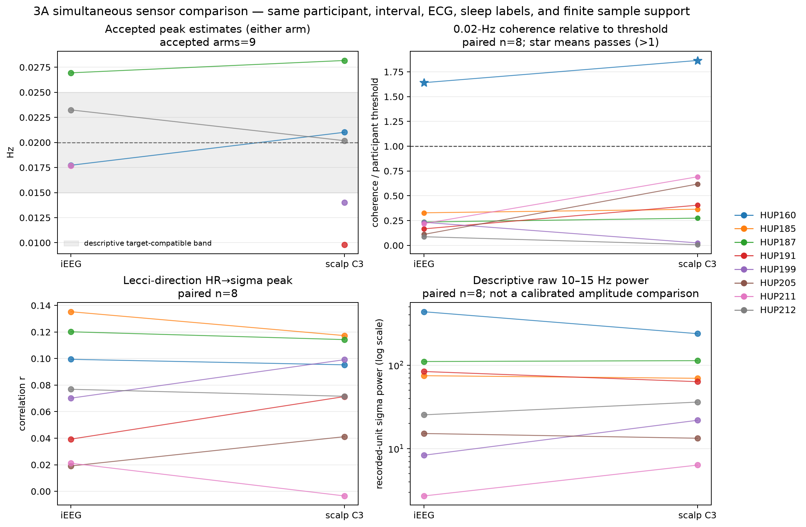
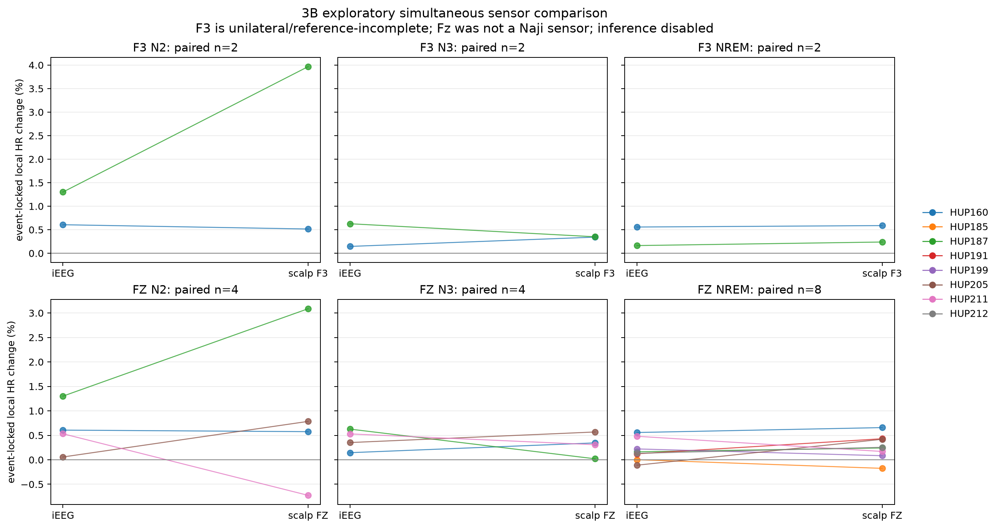

# Simultaneous scalp EEG–iEEG comparison — July 2026

> **Historical v8 result; v9 rebuild pending.** The numerical values below are
> the exact hash-pinned v8 paired analysis. V9 corrects portal sample-count
> validation and SO/event boundaries and removes the legacy activity adapter.
> Do not relabel these values as v9 or publication-current. Regenerate the HUP
> caches, QC grids/public snapshot, scalp sidecars, inventory, and paired
> outputs in the order documented in
> [ARTIFACT_POLICY.md](ARTIFACT_POLICY.md).

## Bottom line

The corrected comparison contains the exact eight-person intersection supported by the frozen
HUP analysis and simultaneous C3/C03 scalp EEG. A snapshot-pinned audit of all 25 HUP
participants found:

- 15 with no C3/C03 label;
- HUP138 and HUP182 with C3 but no valid frozen 3A spectrum; and
- exactly eight with C3/C03, a valid frozen 3A endpoint, and a numerically active full-interval
  scalp sidecar: HUP160, HUP185, HUP187, HUP191, HUP199, HUP205, HUP211, and HUP212.

The primary 3A comparison now uses exactly the same valid seconds and 120-second windows in both
EEG arms. Its result is:

- all eight have paired spectra, 0.02-Hz coherence, and cross-correlation estimates;
- HUP160 is the only participant whose 0.02-Hz coherence exceeds its nominal participant-level
  analytic \(\alpha=0.05\) threshold, and it passes in both iEEG and scalp C3;
- target-compatible accepted peaks occur in iEEG for 3/8 participants and scalp C3 for 2/8:
  HUP160 and HUP212 in both arms, plus HUP211 in iEEG only;
- median coherence is 0.0287 for iEEG and 0.0762 for scalp C3; the median paired difference is
  +0.0235 and the mean paired difference is +0.0269; and
- the exploratory exact sign-flip test on the mean paired coherence difference gives
  \(p=0.102\). This is uncorrected, post-audit, and not an equivalence test.

Thus scalp C3 is descriptively higher on average, but the small sample does not establish a
reliable modality difference, equivalence, or a hidden consistent scalp-only 0.02-Hz effect.

The current 3B result is not a Naji replication. Among these eight participants, only HUP160 and
HUP187 have F3, and neither has F4. The full-cohort audit found that HUP138 alone has both F3 and
F4 labels, but HUP138 has no valid frozen staged 3B endpoint and its online reference is
undocumented. The exact Naji montage and endpoint are therefore unavailable.

Most importantly, neither arm measures LC. These data can test an **LC-compatible downstream
pattern**, but they cannot identify LC activity as its cause.

## What changed from the earlier draft

The earlier paired draft let scalp and iEEG contribute different valid time points. For example,
the iEEG coherence calculation used 11 versus 8 Welch segments for HUP187, 34 versus 22 for
HUP199, and 71 versus 36 for HUP211. Magnitude-squared coherence and its analytic threshold both
depend on the number of segments, so that was a real comparison confound.

The corrected primary result intersects finite positive iEEG sigma/SWA, finite positive scalp
sigma/SWA, and finite shared HR before either arm is analyzed. It then fails unless bout lengths,
Welch segment counts, thresholds, and the exact retained 120-second cross-correlation window
starts match between arms.

| 3A summary | Earlier independent support | Corrected shared support |
|---|---:|---:|
| Median iEEG coherence | 0.0523 | 0.0287 |
| Median scalp coherence | 0.0771 | 0.0762 |
| Median scalp − iEEG coherence | +0.0007 | +0.0235 |
| Exact sign-flip p (absolute mean difference) | 0.727 | 0.102 |
| Target-compatible accepted peaks | same 2 in both | 2 in both + HUP211 iEEG-only |
| Above analytic threshold | HUP160 in both | HUP160 in both |

This correction materially changes the descriptive 3A effect estimate and peak accounting, but
not the threshold-pass conclusion. It does not change 3B, whose event analysis does not use this
3A common-support comparison.

### Flat-file export correction

The v2 role-pair CSV repeated the same iEEG 3B estimate under both `f3` and `fz` for HUP160 and
HUP187. That repetition was correct for reconstructing each role-specific contrast, but pooling
the file without `comparison_role` over-weighted those two participants. It did not affect
`group_summary.json`, the figures, or any headline value because those artifacts are calculated
directly from one participant record at a time.

In v3, `paired_metrics.csv` is normalized to one observation per
subject/question/stage/modality. The separate `role_pair_metrics.csv` retains explicit F3/Fz
pair membership and intentionally repeats a shared iEEG comparator when it contributes to both
roles; that table must not be pooled across roles.

## What was held fixed

For each participant, both EEG arms use:

- the same immutable iEEG.org snapshot and simultaneous time base;
- the same frozen seven-hour interval and sample rate;
- the same cached ECG, RR series, and one-second HR series;
- the same sleep labels; and
- the same 3A estimator and endpoint-local profile.

The comparison hashes these inputs, verifies both cache manifests and every cache file, and
requires the recomputed independent-support iEEG 3A and 3B objects to exactly reproduce the
frozen QC grid. All eight exact checks passed.

The phrase “same sleep labels” needs an important qualification: HUP labels are generated from
iEEG delta/SWA with a GMM, without independent visual PSG scoring or EOG/EMG. Holding them fixed
is a good timing control, but it makes the comparison asymmetric and cannot validate the
scalp-paper staging method.

The comparison also does not isolate a pure scalp-versus-iEEG physics effect. The arms differ
jointly in location, online reference, spatial scale, and aggregation: one C3/C03 scalp channel
is compared with an aggregate of selected intracranial contacts.

## Why 74%, 75%, or 80% is not a magic qualification boundary

No participant was removed from this paired result for failing an arbitrary 80% rule. The
actual shared fractions were:

| Participant | Shared finite EEG/HR fraction | Welch segments \(K\) | 0.02-Hz threshold |
|---|---:|---:|---:|
| HUP160 | 89.0% | 18 | 0.162 |
| HUP185 | 78.8% | 5 | 0.527 |
| HUP187 | 84.0% | 8 | 0.348 |
| HUP191 | 87.9% | 25 | 0.117 |
| HUP199 | 82.1% | 22 | 0.133 |
| HUP205 | 95.2% | 12 | 0.238 |
| HUP211 | 44.0% | 36 | 0.082 |
| HUP212 | 61.8% | 17 | 0.171 |

HUP185, HUP211, and HUP212 remain analyzed even though their whole-record common support is below
80%. The locked endpoint-local profile does not pretend that 79.9% is bad while 80.0% is good.
Instead, the estimator uses the actual valid NREM segments, and each participant's coherence
threshold reflects the resulting \(K\). Less support usually means less precision; it is not an
automatic biological disqualification.

## 3A: infraslow sigma–heart-rate coordination

Question 3A asks whether 10–15-Hz sigma power and HR show coordinated, approximately 50-second
fluctuations during NREM. A 50-second period is \(1/50=0.02\) Hz. SWA means
**slow-wave activity**, here 0.5–4-Hz EEG power. It is a comparison signal, not an individual
slow oscillation and not an LC measurement.

### Accepted spectral peaks

“Accepted” means the fitted peak passed the estimator's shape/quality rules. The
0.015–0.025-Hz target-compatible band is a descriptive ±0.005-Hz window around 0.02 Hz, not a
threshold defined by Lecci.

| Participant | iEEG accepted peak | Scalp C3 accepted peak | Description |
|---|---:|---:|---|
| HUP160 | 0.01773 Hz | 0.02101 Hz | target-compatible in both |
| HUP185 | none | none | neither |
| HUP187 | 0.02694 Hz | 0.02817 Hz | accepted in both, above target band |
| HUP191 | none | 0.00980 Hz | scalp-only, near 0.01 Hz |
| HUP199 | none | 0.01399 Hz | scalp-only, below target band |
| HUP205 | none | none | neither on shared support |
| HUP211 | 0.01769 Hz | none | target-compatible iEEG-only |
| HUP212 | 0.02324 Hz | 0.02017 Hz | target-compatible in both |

Counting every accepted peak gives 4/8 iEEG arms and 5/8 scalp arms. Restricting the description
to the prespecified target-compatible neighborhood gives 3/8 iEEG and 2/8 scalp. Neither count
is a hypothesis test.

### Coherence and participant-specific thresholds

| Participant | iEEG coherence | Scalp coherence | Threshold | Pass |
|---|---:|---:|---:|---|
| HUP160 | 0.2651 | 0.3012 | 0.1616 | both |
| HUP185 | 0.1733 | 0.1923 | 0.5271 | neither |
| HUP187 | 0.0821 | 0.0957 | 0.3482 | neither |
| HUP191 | 0.0196 | 0.0476 | 0.1173 | neither |
| HUP199 | 0.0310 | 0.0033 | 0.1329 | neither |
| HUP205 | 0.0264 | 0.1474 | 0.2384 | neither |
| HUP211 | 0.0180 | 0.0567 | 0.0820 | neither |
| HUP212 | 0.0149 | 0.0012 | 0.1707 | neither |

HUP160 alone exceeds its nominal participant-level analytic \(\alpha=0.05\) threshold in both
arms. These thresholds are not corrected across participants or endpoints. HUP212 has accepted
peaks near 0.02 Hz in both spectra, but neither arm exceeds its nominal analytic threshold. A
within-signal spectral peak and between-signal coherence answer different questions.

### Paired 3A summary

| Endpoint | n | iEEG median | Scalp median | Median scalp − iEEG | Mean difference | Exact sign-flip p |
|---|---:|---:|---:|---:|---:|---:|
| Coherence at 0.02 Hz | 8 | 0.0287 | 0.0762 | +0.0235 | +0.0269 | 0.102 |
| Lecci-direction HR→sigma peak \(r\) | 8 | 0.0735 | 0.0834 | −0.0047 | +0.0032 | 0.695 |
| Lecci-direction peak lag | 8 | 0 s | 0 s | 0 s | −1.5 s | 0.500 |

The sign-flip test statistic is the absolute **mean** paired difference; the median is displayed
as a robust descriptive estimate. Tests are exploratory, uncorrected, and too small to establish
equivalence.

### SWA frequency-specificity control

At the fitted sigma-peak window, normalized sigma power exceeded normalized same-window SWA for
the target-compatible cases:

- HUP160: sigma/SWA = 1.29 iEEG and 1.40 scalp;
- HUP211: 1.76 in its iEEG-only accepted peak; and
- HUP212: 1.26 iEEG and 1.32 scalp.

HUP187's off-target 0.027–0.028-Hz peaks had ratios below one in both arms. This is a descriptive
frequency-specificity check, not a significance test.

## 3B: slow-oscillation–heart-rate event timing

Question 3B asks whether a cortical slow-oscillation event is followed by a small HR change. It
is based on Naji's central–autonomic coupling analysis, not on a direct LC measure.

### Why an exact Naji test is unavailable

Naji derived an SO-triggered cardiac curve separately for referenced F3/A2 and F4/A1, found each
electrode's HR-maximum/RR-minimum time, and then averaged those electrode-specific times. The
full 25-person inventory found:

- HUP138 has unique F3 and F4 labels, but no valid frozen N2, N3, or pooled-NREM 3B endpoint;
- HUP160 and HUP187 have F3 but no F4; and
- the online references are undocumented, and no A1/A2/M1/M2 label proves how F3/F4 was
  recorded.

Therefore HUP138 is the closest label match but cannot currently produce a staged result.
HUP160/HUP187 provide only a unilateral, reference-incomplete sensitivity analysis.

### Available unilateral F3 result

| Stage | Paired n | iEEG median local HR change | Scalp F3 median local HR change |
|---|---:|---:|---:|
| N2 | 2 | 0.953% | 2.241% |
| N3 | 2 | 0.386% | 0.346% |
| pooled NREM | 2 | 0.360% | 0.413% |

For Naji's “percent above stage mean” description, the unilateral F3 medians are 2.046% in N2
and 0.369% in N3. Naji reported healthy-group means of 12.09% and 3.35%. Those published means
are context, not pass/fail thresholds. Our medians are about 17% and 11% of those means and come
from two epilepsy inpatients with a different reference and an adapted amplitude rule.

Fz is available in all eight paired participants but was not a Naji sensor:

- pooled NREM \(n=8\): iEEG median 0.147% versus Fz median 0.248%;
- median paired difference +0.089 percentage points;
- exploratory exact sign-flip \(p=0.547\); and
- N2 and N3 each have only four paired participants.

No 3B event-locking p value is accepted as confirmatory because the null remains unvalidated for
clustered slow oscillations and nonstationary HR. Opposite-polarity detection is also unavailable
from the current sidecar; intracranial and undocumented scalp references can reverse slow-wave
polarity.

## Why these results are not proven to be LC-driven

The accurate statement is not “LC definitely did not contribute.” LC could contribute. The
accurate statement is:

> The observed cortical and cardiac rhythms are compatible with an LC-linked mechanism, but
> this dataset cannot identify LC as their cause.

| Evidence level | Present here? | What it establishes |
|---|---|---|
| Scalp EEG/iEEG sigma, SWA, and slow oscillations | yes | cortical sleep dynamics |
| ECG-derived HR/RR | yes | cardiac/autonomic dynamics |
| Correlation/coherence | yes | coordination, not the coordinator |
| Direct LC-neuron recording | no | — |
| Direct norepinephrine measurement | no | — |
| Selective LC/NE perturbation | no | — |
| Independently validated human LC marker in these participants | no | — |

[Lecci et al. 2017](https://pubmed.ncbi.nlm.nih.gov/28246641/) measured human scalp EEG and HR;
it did not measure human LC neurons or norepinephrine. [Naji et al.
2019](https://escholarship.org/uc/item/5393b9zk) measured scalp slow oscillations and cardiac
timing and described central–autonomic coupling, not an LC assay.

[Osorio-Forero et al. 2021](https://pubmed.ncbi.nlm.nih.gov/34648731/) supplies strong
mechanistic evidence in mice: norepinephrine fluctuated near this timescale, and timed LC
activation/inhibition altered or entrained spindle clustering and HR variation. That makes the
human proxy hypothesis plausible, but mouse causality does not make a human EEG/ECG pattern
LC-specific.

A [Jacobsen et al. eLife reviewed preprint](https://elifesciences.org/reviewed-preprints/110252)
similarly combines causal mouse LC/NE work with a correlational human HR/sigma arm. The review
notes that some human associations were not sigma-specific. It supports candidate readouts, not
a uniquely validated human LC meter.

Plausible alternatives include:

- microarousals, K-complex/CAP-like dynamics, or ordinary changes in sleep depth affecting both
  cortical activity and HR;
- respiration/apnea, baroreflexes, vagal/sympathetic balance, or other brainstem/hypothalamic
  circuits;
- medication, epilepsy, interictal discharges, seizures, or postictal physiology; and
- an unmeasured common driver that affects both signals.

Matching the expected frequency and timing is therefore a pattern match, not source
identification. A stronger human LC claim needs an independent LC/NE-sensitive measurement or a
selective LC manipulation in the same participants, plus controls for arousal, respiration,
stage, medication, and epileptic activity.

## Does raw scalp or iEEG power tend to be larger?

Not consistently in these data. The participant-level scalp/iEEG median sigma-power ratios range
from 0.55 to 2.62; four are below one and four are above one, with a median near 0.98. That is a
diagnostic, not evidence of a universal amplitude law.

Scalp and iEEG recorded-unit power depend on online reference, amplifier/gain, impedance, source
orientation and depth, skull/volume conduction, spatial averaging, and contact selection. A
simultaneous ECoG–scalp study also found frequency-dependent rather than universally ordered
power ratios ([Petroff et al. 2016](https://pubmed.ncbi.nlm.nih.gov/26386645/)).

The scientifically interpretable comparison is therefore normalized temporal structure,
coherence, and event timing—not raw recorded-unit amplitude.

## Why a v9 rebuild is required

The saved paired analysis preserves the exact frozen v8 iEEG results for
lineage. Those caches did not store the v9 exact acquisition-count and complete
event-boundary fields. Their raw-voltage flat-line extrema also cannot be
reconstructed retrospectively. The v9 paired path no longer patches a legacy
activity mask in memory: it requires the current cache’s stored activity QC and
fails closed otherwise. A full all-HUP cache/QC-grid/sidecar rebuild is
therefore required to learn whether the corrected inputs change 3A/3B/3D
results.

This matters especially for HUP138: the old frozen staging has no valid sleep endpoint, while the
source pin previously admitted F8 as an intracranial candidate. The selector is fixed, but the
current paired result must not claim what a clean HUP138 rebuild will show.

## Files and reproducibility

- [3A figure](../outputs/paired_scalp_ieeg/paired_3A_C3.png)
- [3B figure](../outputs/paired_scalp_ieeg/paired_3B_F3_Fz.png)
- [Group summary](../outputs/paired_scalp_ieeg/group_summary.json)
- [Participant results](../outputs/paired_scalp_ieeg/subject_results.json)
- [Normalized subject-stage metrics](../outputs/paired_scalp_ieeg/paired_metrics.csv)
- [Explicit role-pair metrics](../outputs/paired_scalp_ieeg/role_pair_metrics.csv)
- [Result manifest](../outputs/paired_scalp_ieeg/RUN_MANIFEST.json)
- [All-25 scalp inventory](../outputs/paired_scalp_inventory/hup_scalp_channel_inventory.json)
- [Inventory manifest](../outputs/paired_scalp_inventory/RUN_MANIFEST.json)
- [Inventory program](../analysis/audit_hup_scalp_inventory.py)
- [Sidecar builder](../analysis/cache_paired_scalp.py)
- [Comparison program](../analysis/paired_scalp_ieeg_comparison.py)
- [Regression checks](../analysis/test_paired_scalp.py)

The scalp NPZ sidecars are ignored derived data. Their terminal local manifest pins the exact
eight files used for the checked-in, hash-manifested inventory and result artifacts.
